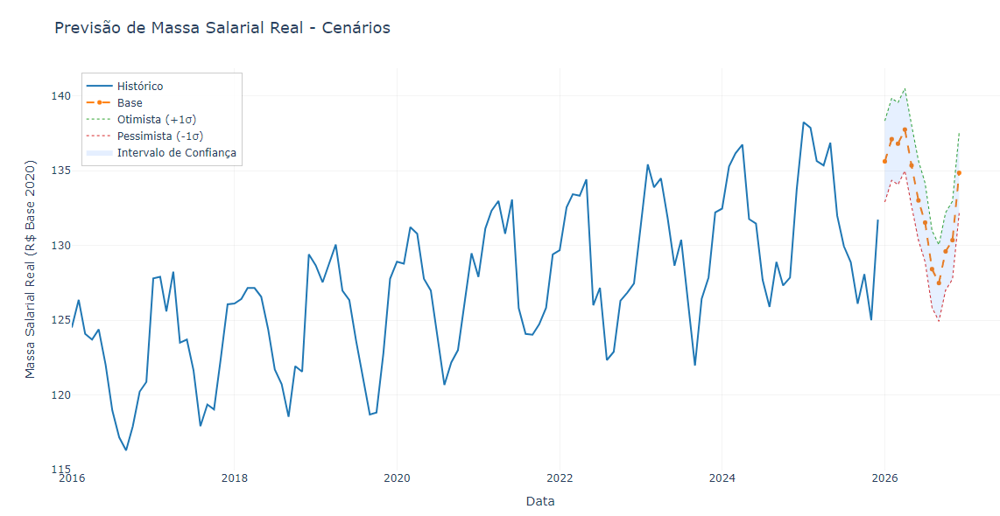
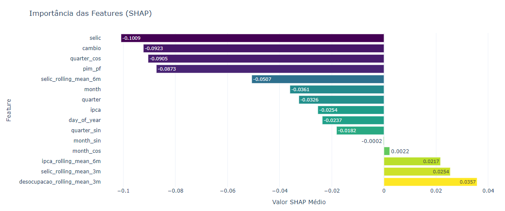

# Industrial Wage Mass Forecasting

**Previsão da Massa Salarial Real e Nowcasting da Indústria de Transformação**

Repositório técnico para modelagem econométrica e forecasting de séries temporais financeiras e macroeconômicas em Python.

---

## 1. Visão Geral

Este repositório implementa um pipeline modular para previsão da massa salarial real da indústria de transformação em um horizonte de 12 meses, integrado a um motor de **Nowcasting de Alta Frequência** para estimativa do mês corrente ($t$) antes da publicação dos microdados oficiais pelo Ministério do Trabalho e Emprego (MTE/IBGE).

### Componentes Principais
- **Ingestão de Dados Públicos**: Ingestão automática via APIs do SIDRA/IBGE (Produção Física PIM-PF) e IPEADATA (Taxa SELIC, Taxa de Desocupação, Câmbio USD/BRL e IPCA).
- **Engine de Nowcasting (Tempo Real)**: Estimativa da atividade no mês presente ($t$) via dados de alta frequência de fontes alternativas (*Google Trends* para intenção de emprego e consumo de energia elétrica industrial via ONS/EPE) utilizando regressões de frequências mistas (*Bridge Models* e XGBoost Nowcaster).
- **Modelagem Híbrida de Previsão (12 Meses)**: Prophet (baseline decomponível de tendência e sazonalidade) versus XGBoost supervisionado (modelo exógeno ex-ante).
- **Validação Temporal Estrita**: Avaliação *out-of-sample* via `TimeSeriesSplit` (janela expansiva de treino e teste móvel) para prevenção de vazamento de dados (*data leakage*).
- **Interpretabilidade (XAI)**: Atribuição de importância global e local via valores SHAP (*SHapley Additive exPlanations*).
- **Projeção de Cenários**: Simulação de trajetórias sob 3 cenários macroeconômicos (Pessimista -1σ, Base 0σ, Otimista +1σ).

---

## 2. Arquitetura do Repositório

```
industrial_wage_forecasting/
├── config.py                     # Dataclasses de configuração (DataConfig, NowcastingConfig)
├── main.py                       # Pipeline de execução do Forecasting (12 meses)
├── main_nowcasting.py            # Pipeline de execução do Nowcasting (mês corrente)
├── data_pipeline.py              # Coleta, tratamento e deflacionamento das séries
├── feature_engineering.py        # Construção de lags, médias móveis, choques e ciclos
├── model_training.py             # Treinamento, TimeSeriesSplit e avaliação dos estimadores
├── visualization.py              # Geração de figuras Plotly e relatórios visuais
├── src/
│   └── nowcasting/               # Módulo de frequências mistas e dados alternativos
│       ├── __init__.py
│       ├── google_trends_collector.py  # Coletor Pytrends de tendências de busca
│       ├── energy_data_loader.py       # Ingestão de carga de energia industrial ONS
│       ├── feature_aligner.py          # Alinhador temporal diário/semanal -> mensal
│       ├── midas_bridge_model.py       # Modelos ponte (ElasticNet/Ridge) & XGBoost
│       ├── nowcast_evaluator.py        # Avaliação pseudo real-time out-of-sample
│       └── nowcast_visualization.py    # Visualização Nowcast vs. Forecast
├── tests/
│   ├── conftest.py
│   └── test_nowcasting.py        # Suíte de testes unitários com pytest
├── results/                      # Relatórios numéricos em CSV
└── README.md
```

---

## 3. Resultados Visuais e Artefatos

Os relatórios visuais interativos são gerados na pasta `outputs/`. Abaixo estão as representações estáticas das saídas do pipeline:

### Previsão de 12 Meses e Cenários Macroeconômicos

*Projeção da massa salarial real com cenários Base, Otimista (+1σ) e Pessimista (-1σ).*

### Explicabilidade por SHAP Values (XAI)

*Importância relativa dos preditores macroeconômicos e lags autoregressivos.*

---

## 4. Instruções de Execução

### Instalação das Dependências

```bash
git clone https://github.com/p-esteves/industrial_wage_forecasting.git
cd industrial_wage_forecasting

python -m venv venv
source venv/bin/activate  # Linux/Mac
# ou venv\Scripts\activate  # Windows

pip install -r requirements.txt
```

### Execução dos Pipelines

```bash
# Executar o pipeline completo de previsão (12 meses à frente)
python main.py

# Executar o motor de Nowcasting (alta frequência do mês corrente)
python main_nowcasting.py

# Executar a suíte de testes unitários
pytest tests/ -v
```

---

## 5. Especificação Metodológica e Tratamento de Dados

### Deflacionamento das Séries Monetárias
Para remover a distorção inflacionária, a massa salarial nominal é convertida para Reais constantes (Base 2020) utilizando a série histórica do IPCA acumulado:

$$\text{Massa Salarial Real}_t = \frac{\text{Massa Salarial Nominal}_t}{\text{IPCA}_t / \text{IPCA}_{2020}}$$

### Engenharia de Atributos (Features)

| Categoria | Variáveis / Lags | Racional Econômico |
|---|---|---|
| **Autoregressivos** | `massa_salarial_real_lag1`, `lag3`, `lag6`, `lag12` | Captura a inércia salarial e a periodicidade anual dos acordos coletivos (dissídios). |
| **Atividade Real** | `pim_pf_rolling_mean_3m`, `rolling_mean_6m` | A produção física industrial (PIM-PF) atua como indicador antecedente da renda real. |
| **Política Monetária** | `selic_12m_change`, `selic_shock_magnitude` | Mudanças na taxa SELIC afetam a renda industrial com defasagem (~12 meses) via crédito. |
| **Sazonalidade Cíclica** | `month_sin`, `month_cos`, `quarter_sin`, `quarter_cos` | Transformação senoidal/cossenoidal para preservar a continuidade periódica dos meses. |

---

## 6. Decisões de Modelagem e Validação

### Racional da Escolha dos Estimadores
1. **Prophet (Baseline Decomponível)**: Selecionado como baseline por decompor nativamente tendência linear/não-linear, sazonalidade aditiva e apresentar resiliência a outliers históricos.
2. **XGBoost (Challenger Supervisionado)**: Utilizado para capturar interações não-lineares entre variáveis exógenas (ex.: relação assimétrica entre câmbio, inflação e nível de emprego).

### Prevenção de Data Leakage e TimeSeriesSplit
A validação dos modelos é feita por **validação cruzada temporal expansiva** (`TimeSeriesSplit`), garantindo que o conjunto de treinamento utilize estritamente observações anteriores ao horizonte de teste:

```
Fold 1: Treino [t_0 ... t_48] | Teste [t_49 ... t_60]
Fold 2: Treino [t_0 ... t_60] | Teste [t_61 ... t_72]
Fold 3: Treino [t_0 ... t_72] | Teste [t_73 ... t_84]
```

### Métricas de Avaliação

```python
results = {
    'Prophet': {
        'RMSE': 2.2014,
        'MAE': 1.8322,
        'MAPE': 0.0135,
        'MASE': 0.7412
    },
    'XGBoost': {
        'RMSE': 3.6504,
        'MAE': 3.2011,
        'MAPE': 0.0241,
        'MASE': 1.2944
    }
}
```

*Nota Metodológica*: No teste *out-of-sample*, o Prophet apresentou menor erro absoluto (RMSE 2.20 vs 3.65 do XGBoost) devido à sua maior capacidade de suavização de tendência em janelas pequenas, enquanto o XGBoost sofreu maior variância na previsão recursiva de longo prazo.

---

## 7. Referências Acadêmicas

- **Chen, T., & Guestrin, C. (2016)**. XGBoost: A scalable tree boosting system. *Proceedings of the 22nd ACM SIGKDD*, 785-794.
- **Lundberg, S. M., & Lee, S. I. (2017)**. A unified approach to interpreting model predictions. *Advances in Neural Information Processing Systems 30*, 4765-4774.
- **Taylor, S. J., & Letham, B. (2018)**. Forecasting at scale. *The American Statistician*, 72(1), 37-45.
---

## Limitações Metodológicas e Melhorias Futuras

- **Previsão Recursiva Multi-step**: A extrapolação recursiva no XGBoost tende a acumular variância em horizontes superiores a 6 meses. Sugere-se a avaliação de estimadores de projeção direta (*Direct Multi-Step Forecasting*).
- **Quebras Estruturais**: Séries macroeconômicas de massa salarial estão sujeitas a choques exógenos imprevisíveis. Recomenda-se o acoplamento de variáveis de controle para intervenções de política monetária e fiscal.
- **Frequências Mistas no Nowcasting**: O alinhamento das séries de alta frequência utiliza agregações de calendário. Em desdobramentos de produção, pode-se incorporar polinômios de Almon para suavização diária contínua.
